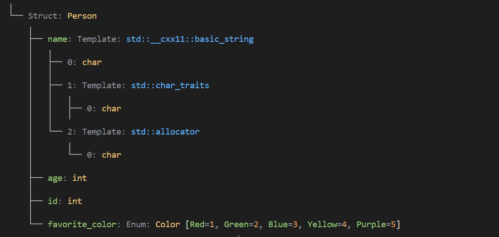

## Type Vision

简体中文 | [English](README_en.md)


这是一个使用`C++20`编写的类型解析器，旨在提供对`C++`类型的树状可视化 ,受[16bit-ykiko/magic-cpp](https://github.com/16bit-ykiko/magic-cpp)的启发,使用**类型特化**和反射库[yalantinglibs](https://github.com/alibaba/yalantinglibs)来实现类型解析。这使得代码量相比[16bit-ykiko/magic-cpp](https://github.com/16bit-ykiko/magic-cpp)大大减少。

## 功能
当前的功能特别简单 ,只是用于解析类型并打印出类型的树状结构。
例如对于
```cpp
#include "parser.hpp"

int main()
{
    using T = int (*(*(*)(int*))[4])(int*); // 复杂的C风格函数指针类型 ,能看懂这个那算是谭浩强受害者了
    type_vision::static_parse::Parser<T>::type::print();
    return 0;
}
```
### 输出:


或者你可能遇到`std::function`天才代码
```cpp
#include "parser.hpp"

int main()
{
    using T = std::function<int(const std::vector<int>&, std::tuple<int, int, int>)>; // hard to understand
    type_vision::static_parse::Parser<T>::type::print();
    return 0;
}
```
### 输出:

## 反射带来高级特性
由于使用了编译器宏和反射库`yalantinglibs` ,所以可以解析出更复杂的类型。
#### 1. 枚举类型

```cpp
#include "parser.hpp"


enum class Color
{
    Red=1,
    Green,
    Blue,
    Yellow,
    Purple
};

int main()
{
    using T = Color;
    type_vision::static_parse::Parser<T>::type::print();
    return 0;
}
```
### 输出:


#### 2. 类对象
> 满足聚合体的类对象可以被解析
```cpp
#include "parser.hpp"
#include <string>


enum class Color
{
    Red=1,
    Green,
    Blue,
    Yellow,
    Purple
};

class Person
{
public:
    std::string name;
    int age;
    int id;
    Color favorite_color;
public:
    void setName(const std::string& name) { this->name = name; }
    void setAge(int age) { this->age = age; }
    void setId(int id) { this->id = id; }
    void setFavoriteColor(Color color) { this->favorite_color = color; }
    std::string getName() const { return name; }
    int getAge() const { return age; }
    int getId() const { return id; }

};
int main()
{
    using T = Person;
    type_vision::static_parse::Parser<T>::type::print();
    return 0;
}
```


### 输出:

聚合类对象的要求:
*   **没有用户声明的构造函数。**
*   **没有私有或受保护的非静态数据成员。**
*   没有虚函数。
*   没有虚、私有或受保护的基类。

### 3. NTTP的解析
```cpp
#include "parser.hpp"
#include <string>
template <int N>
struct Array {
    int data[N];
};
int main() {
    using T = Array<5>; // 数组类型
    type_vision::static_parse::Parser<T>::type::print();
    return 0;
}
```
### 输出:


## 可能的功能列表
- [x] 支持类型树的可视化
- [x] 支持`lambda`表达式的解析
- [ ] 支持不同类型树的`diff`
- [ ] 类型树序列化为`json`或者`yaml`
- [ ] 实现从类型树构造为合法且易懂的C++代码
- [ ] 使用C++26反射实现更复杂的类解析


## License

This project is licensed under the Creative Commons Attribution-NonCommercial 4.0 International License. You can view the full license [here](LICENSE).
根据该License严禁将该项目用于任何商用目的。

