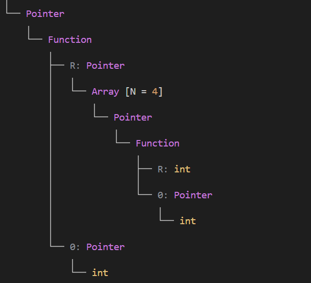
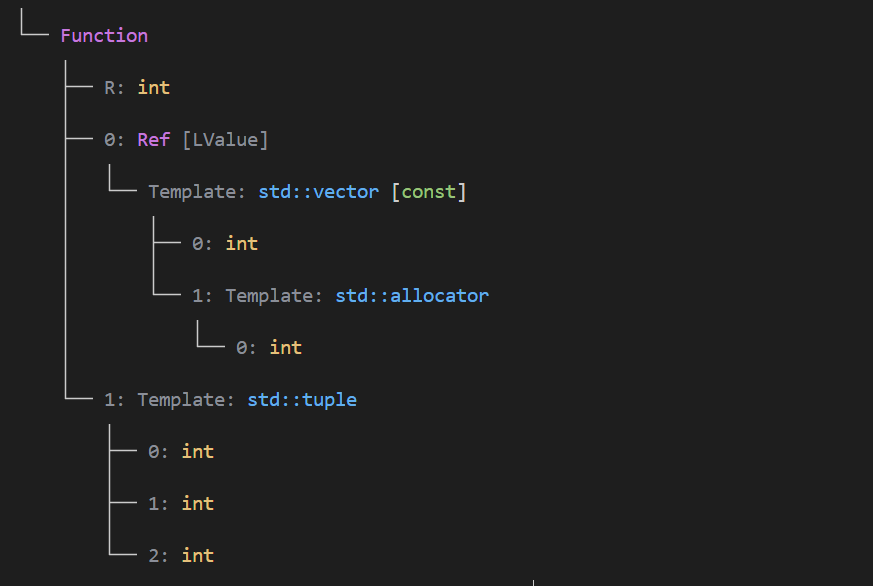
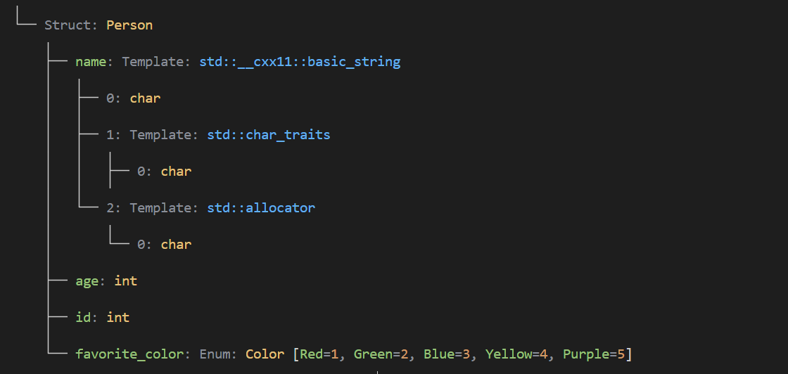
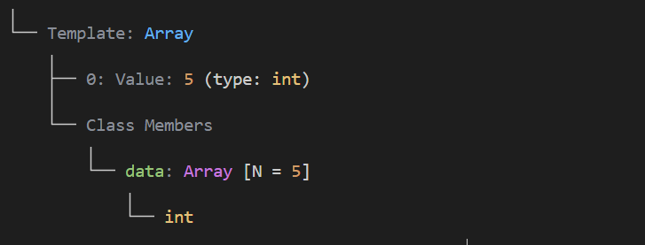

## Type Vision


English | [简体中文](README.md)


This is a type parser written in `C++20`, designed to provide a tree-like visualization of `C++` types. Inspired by [16bit-ykiko/magic-cpp](https://github.com/16bit-ykiko/magic-cpp), it uses template specialization and the reflection library [yalantinglibs](https://github.com/alibaba/yalantinglibs) to implement type parsing. This significantly reduces the amount of code compared to [16bit-ykiko/magic-cpp](https://github.com/16bit-ykiko/magic-cpp).

## Features
Currently, the functionality is very simple: it just parses types and prints their tree structure.
For example, for a
```cpp
#include "parser.hpp"

int main()
{
    using T = int (*(*(*)(int*))[4])(int*); // A complex C-style function pointer type
    type_vision::static_parse::Parser<T>::type::print();
    return 0;
}
```
### Output:


Or you might encounter some "genius" `std::function` code:
```cpp
#include "parser.hpp"

int main()
{
    using T = std::function<int(const std::vector<int>&, std::tuple<int, int, int>)>; // hard to understand
    type_vision::static_parse::Parser<T>::type::print();
    return 0;
}
```
### Output:


## Advanced Features via Reflection
By using compiler macros and the reflection library `yalantinglibs`, more complex types can be parsed.

#### 1. Enum Types

```cpp
#include "parser.hpp"

enum class Color
{
    Red=1,
    Green,
    Blue,
    Yellow,
    Purple
};

int main()
{
    using T = Color;
    type_vision::static_parse::Parser<T>::type::print();
    return 0;
}
```
### Output:


#### 2. Class Objects
> Class objects that are aggregate types can be parsed.
```cpp
#include "parser.hpp"
#include <string>

enum class Color
{
    Red=1,
    Green,
    Blue,
    Yellow,
    Purple
};

class Person
{
public:
    std::string name;
    int age;
    int id;
    Color favorite_color;
public:
    void setName(const std::string& name) { this->name = name; }
    void setAge(int age) { this->age = age; }
    void setId(int id) { this->id = id; }
    void setFavoriteColor(Color color) { this->favorite_color = color; }
    std::string getName() const { return name; }
    int getAge() const { return age; }
    int getId() const { return id; }
};

int main()
{
    using T = Person;
    type_vision::static_parse::Parser<T>::type::print();
    return 0;
}
```

### Output:

Requirements for an aggregate class object:
*   **No user-declared constructors.**
*   **No private or protected non-static data members.**
*   No virtual functions.
*   No virtual, private, or protected base classes.

### 3. Parsing NTTP (Non-Type Template Parameters)
```cpp
#include "parser.hpp"
#include <string>

template <int N>
struct Array {
    int data[N];
};

int main() {
    using T = Array<5>; // Array type
    type_vision::static_parse::Parser<T>::type::print();
    return 0;
}
```
### Output:


## Possible Feature List
- [x] Support for type tree visualization
- [x] Support for parsing `lambda` expressions
- [ ] Support for `diff`ing different type trees
- [ ] Serialize type tree to `json` or `yaml`
- [ ] Implement generation of legal and readable C++ code from a type tree
- [ ] Use C++26 reflection for more complex class parsing

## License

This project is licensed under the Creative Commons Attribution-NonCommercial 4.0 International License. You can view the full license [here](LICENSE).
According to this License, any commercial use of this project is strictly prohibited.
